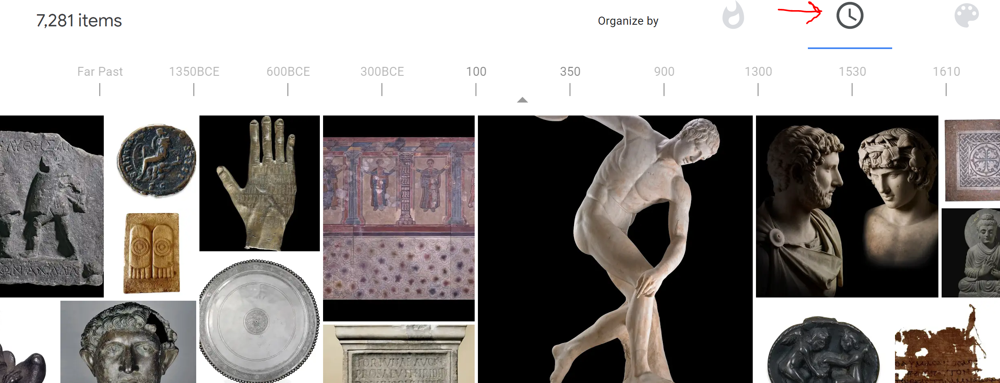

These are organizations that have digitized a number of high resolution scans. I am only listing sources that I think are quality, with either creative commons license or public domain licensing on most of the items.

## Useful and high quality resources

[New York Public Library Collection](https://digitalcollections.nypl.org/) — Not exactly an art collection, it contains almost a million scans of old drawings, maps, and photographs. Lots of really cool historical stuff. My favorite are the thousands of [restaurant menus, searchable by decade](http://menus.nypl.org/menus) back to the 1800's. It even has airline menus from the 1980's such as [TAP Portugal](http://menus.nypl.org/menu_pages/53824/explore) and the [Air France Concorde](http://menus.nypl.org/menu_pages/44451).

[The British Museum](hhttps://www.britishmuseum.org/collection) — over 2 million well categorized, [searchable](https://research.britishmuseum.org/research/collection_online/search.aspx) records, almost all of which are Creative Commons licensed. They have a page on [search tips](https://research.britishmuseum.org/research/collection_online/collection_search_guide.aspx) which works great when search isn't buggy, like it is right this second.

[Paris Museums Collection](http://parismuseescollections.paris.fr/en) — Over 300,000 works digitized. Not all items are royalty-free or public domain, but most are. The search is decent, with lots of categories. Lots of folios, manuscripts, and sketches in addition to the usual paintings. Downloading is a little funny, instead of just an image you get a zip with (usually) a very well metadata'd image, a pdf, and a text file. This can be a little annoying if you want 90 paintings to study, but their attention to cataloguing detail is impressive.

[US National Gallery of Art](https://www.nga.gov/collection.html) — Huge collection. Terrible for browsing, but excellent if you know what you want. Very meticulous search parameters and filters by age, country, materials, technique, place of production, etc.

## Useful but terribly organized

[Wikimedia Commons](https://commons.wikimedia.org/wiki/Main_Page) — The Commons boasts 58,727,714 "freely usable media files" (all types). What's not usable is their organization. Works are either put under an author, or else put into categories and subcategories, which a huge number of such categories missing. It's a huge mess.

This makes it surprisingly difficult to find, for instance, all of Leonardo's sketches, or paintings, because they are hidden behind a several categories, and several of his works have no category at all. This makes gathering them all fairly slow. It gets much, much worse when you get to lesser known authors, where even if you know the author you are looking for, you might need to know the name of their book instead, or that they were a german cartographer, etc, in order to find all the places their works are stored.  It's impossible to quickly get something like a list of all Maps by German Cartographers between two dates, despite conceptually this being the point of categories.

With that said, if you're willing to dig, there's all kinds of interesting stuff. But that's true of every resource here, so maybe start with the other ones.

[Google Art](https://artsandculture.google.com/explore) — This project indexes in really high resolution some of the most famous work from the most famous museums. If you want something very popular, the resolution is good. To give an idea, they have 7,281 items from the British Museum, compared to the over 2 million items that the British Museum has digitized themselves.

The navigation is some of the worst I have seen since the days of Flash. Just wild that somebody shipped it years ago and it still hasn't changed.

The **major** plus of Google Art is the timeline view to sort works in a category or museum by year. You still have to deal with the absolutely bonkers navigation.

### Hall of Shame

I was going to list all the museums/collections that I've looked at which were not so useful but that's silly. Suffice to say that there are many online collections with poor navigation, middling resolution, and almost all works copyrighted, and they want you to pay to license even photos of the museum building. Like Guggenheim. Somehow contemporary art people are always the biggest squares.

### Am I missing any?

If you know a very good source that's not on the list, especially for older archival material like early photographs, maps, manuscripts, let me know and I'll add it. (Please don't send me tiny sources, this isn't trying to be an exhaustive list!)