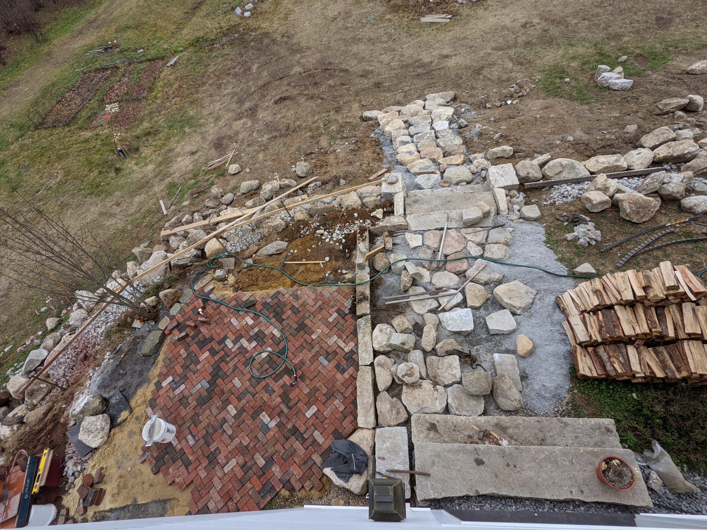

## _This has been updated with pass/fail_

Some context: In 2018 my wife and I bought 3 former haying fields, about 4.5 acres, and built a home there, which we moved into early 2019. [Some pictures](https://twitter.com/simonsarris/status/1183143604925190144). Landscaping was not in the budget, so we're doing it all ourselves, which takes a considerable amount of our time and these goals.

Goals are numbered only in the order I thought of them. I will try to update this page as I succeed or fail.

1. Finish clearing the 3rd field (overtaken by pines) and plant about a half-acre(?) of buckwheat by hand(???) harvest by hand.

❌ _Update august 2020: This failed. See the [official buckwheat planting thread](https://twitter.com/simonsarris/status/1261093563087097857) for details_

2. Move garden closer to house, so we can walk outside with bare feet on brick path to reach it easily from kitchen

(this aerial is old but gives the idea)

✔️ _Update: We created 4 new beds next to the house and used both gardens this year. We will probably add 4 more beds next year to this new upper garden_

✔️ _In the fall we created even more space for gardens close to the house_

3. Pay for a friend with a tractor to build a retaining wall out of granite (already acquired) behind house. Build nice patio. It will look like pictured. Just kidding (unless...?)

✔️✔️✔️❌ _Our friend got seriously injured and was off to a slow start, but now I am working with him to not only build the wall and a stone patio, but rebuild my smaller brick patio much larger:_

4. Build dry stone arch bridge with remaining granite to the 2nd field over the big stream (by "of view")

❌ Alas, have a bridge that the tractor can cross but have not started this at all!

5. Build small shed

✔️ _May update: decided to build a chicken house instead. It is being sided [right now](https://twitter.com/simonsarris/status/1264256237002264577)._

6. Build wood storage outside

❌ / ✔️ _A simple semi-timber framed storage was built, plus a holz-hausen_

7. Turn the entire front lawn into a crazy field of poppies, probably a mix of shirley, california, and icelandic. The california poppies experiment grew really well this year but we'll see how they do year over year.

❌ _May update: Although I planted hundreds of thousands of poppy seeds, either the strange spring weather (very cold then very hot with no rain) or my poor timing has caused only a handful of them to grow. This is very unfortunate, but I will try again next year._

8. Have a baby

_update: [coming July](https://twitter.com/simonsarris/status/1215265380677058563)_

_May update: [30 weeks](https://twitter.com/simonsarris/status/1257628232205111296)_

✔️ _July 21 update: [Luca Marin Sarris](https://twitter.com/simonsarris/status/1286769485375066113)_

9. Design some cottages. It may be many years before we're able to build one, though

❌ _no progress :(_

10. Design a workshop, build it if we have funds? Something really simple, enough to hold woodworking equip, a pottery wheel, and small propane forge hooked up to our 500gal tank?

❌ _!! No progress!!_

11. (in the winter months, mostly) publish more than last year. Winter here lends itself to this sort of thing.

✔️ _Update: I have started [newsletter](https://map.simonsarris.com) in the summer, surprisingly_

12. Host more guests than last year, cook for more people. We both love cooking for other people, but have kept our heads down a lot in 2019.

❌ _Update: so there's this virus..._

13. Make a few more "for fun" websites

❌(✔️? Starting Simeville in earnest)

14. Make a small LLC? And sell some art stuff? I'm not sure what yet, maybe pottery or wood things, just for fun.

❌ _not started_

15. Leave the US at least once (a goal we have for every year, even if its just driving to Montreal)

❌❌❌ _Well the virus will kill this one..._

16. On the 3rd field, start to build a temple to Artemis or Apollo, or the sun. It will almost certainly have to be timber, not stone. Also build a small temple or shrine to Christ. Probably won't be done in 2020.

❌/✔️? We'll see how far I get. I still have a month. It will be a shrine to Saint Marinus.

17. Landscape the "duck pond" area until its beautiful.

  

    

      
    

  

  

    

      
    

  

❌? _June update: I sunk a tractor near here and made it somewhat uglier :D_

✔️? _Fall update: The area has been considerably cleaned up now, mostly raw dirt. The duck pond itself is still fairly plain._

18. Start a book of fables, try to self-publish it before the end of 2021? I have only some notes for this so far, I really don't know how long it will take.

✔️ _May update: started a collection, but it's small so far._

✔️ _August update: Through my [newsletter](https://map.simonsarris.com) I now have several, which I will start the collection nicely._

19. Learn the basics of timber framing. Maybe use 5. and 6. as practice for this.

❌? _Did some very rudimentary stuff with the chook house. August: Practicing some techniques for the wood storage, too._

... ✔️ _In 2022, two years late, I completed a timber framed barn, the [Goose Palace](https://map.simonsarris.com/p/building-the-goose-palace)_

20. Furnish another bedroom in the house. We just got our guest bedroom a bed and mattress (don't all visit at once guys) but it needs everything else.

❌/✔️ _August update: this is 30% complete_

21. Build shelves for the kitchen, just one level, right above the tile

  

❌

22. Build a real kitchen island (right now its just ikea stilts)

  

✔️ _Coming very soon!_

23. Make some kind of village builder, simulator, or collaboration game. Something beautiful. Probably in HTML Canvas. Probably (???) in 3d.

❌ _Started in winter but abandoned due to lack of time, for now_

24. Re-start the orchard, that was started and semi- (mostly?) destroyed this year. Plant bigger trees or come up with something for deer defense.

✔️ _May update: One peach tree is now defended, two new apple trees are in._

25. Find some way to inspire more people, or make them more optimistic. Or find a way to make people want beautiful things & want to make beauty. This is ofc hazy, but I think I'll have a good sense of whether or not I accomplish it.

✔️ _I think I understand this now. Several people have told me to ✔️ this goal but I think most of the work here is yet to come._
