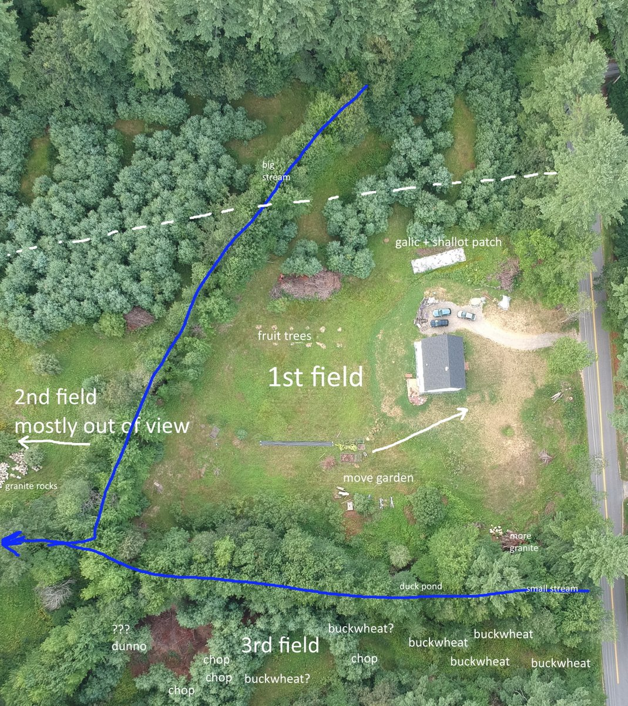
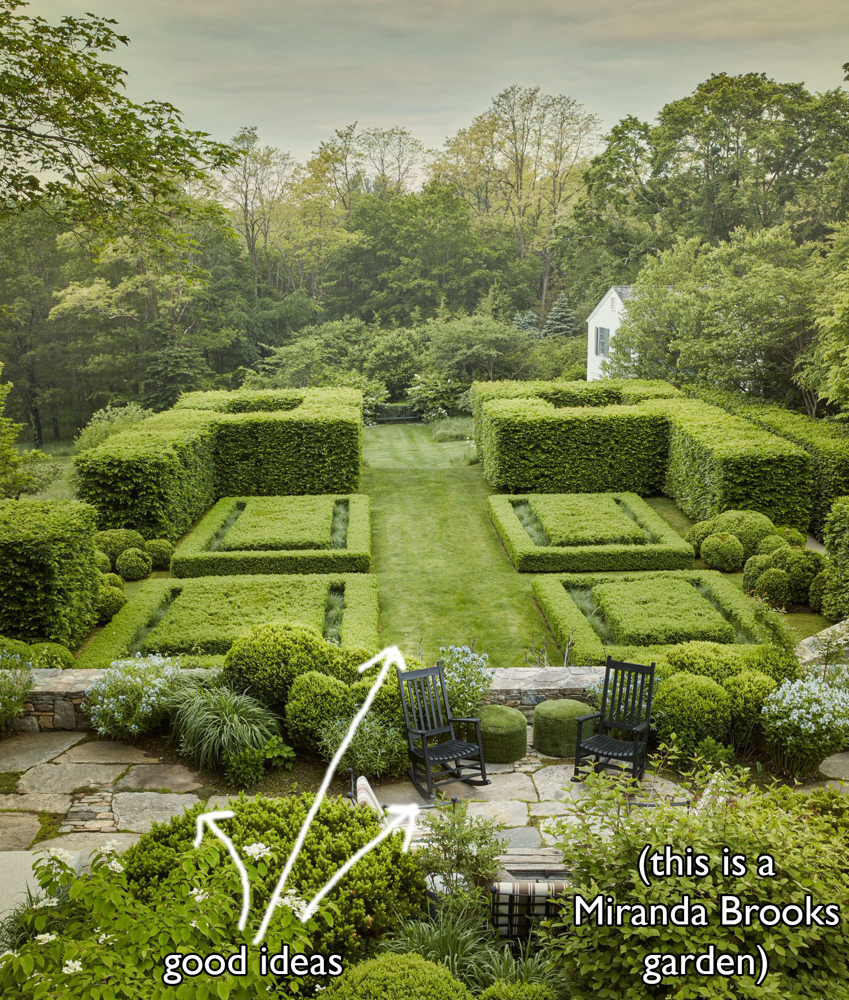
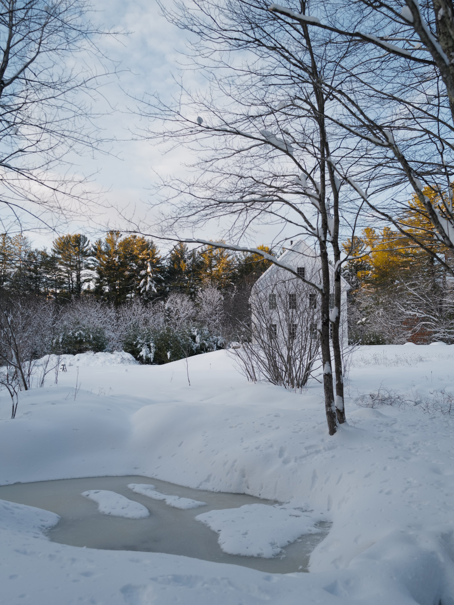
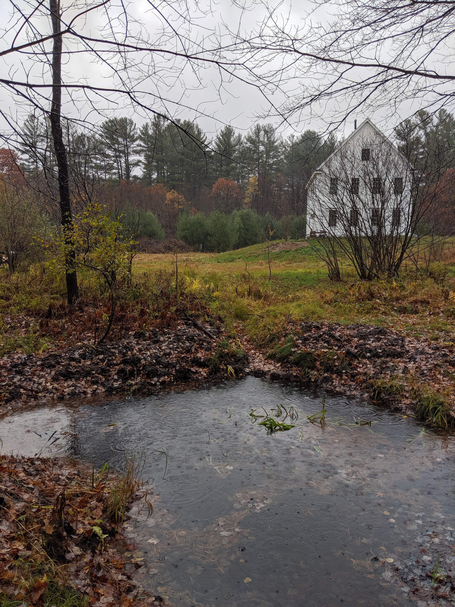
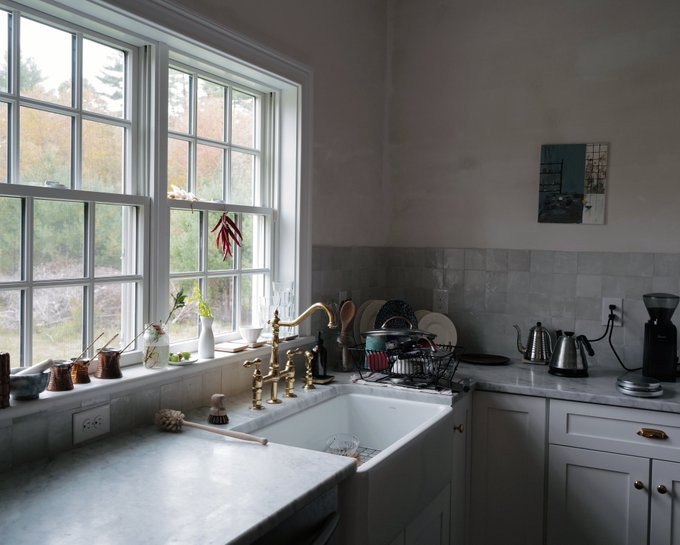
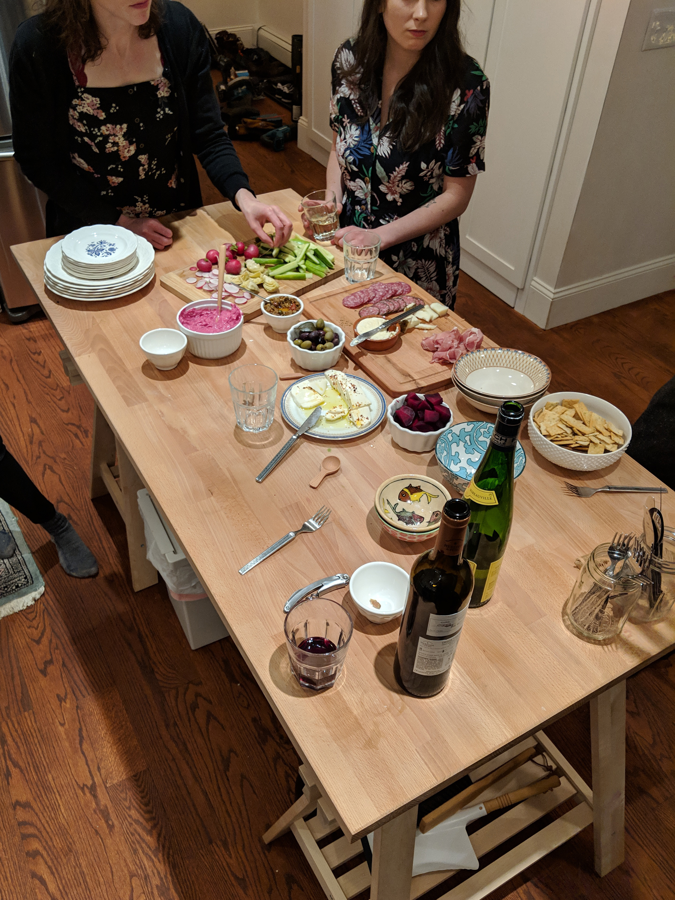

I prefer a list of goals, ideally a list that would be non-trivial to achieve, in lieu of new years resolutions.
I encourage you to make something similar.

Things to accomplish, or try to, in 2020. Goals are numbered only in the order I thought of them. I will try to update this page as I succeed or fail at goals.

1. Finish clearing the 3rd field (overtaken by pines) and plant about a half-acre(?) of buckwheat by hand(???) harvest by hand.

2. Move garden closer to house, so we can walk outside with bare feet on brick path to reach it easily from kitchen

(this aerial is old but gives the idea)

3. Pay for a friend with a tractor to build a retaining wall out of granite (already acquired) behind house. Build nice patio. It will look like pictured. Just kidding (unless...?)

4. Build dry stone arch bridge with remaining granite to the 2nd field over the big stream (by "of view")

5. Build small shed

6. Build wood storage outside

7. Turn the entire front lawn into a crazy field of poppies, probably a mix of shirley, california, and icelandic. The california poppies experient grew really well this year but we'll see how they do year over year.

8. Have a baby

*update: [coming July](https://twitter.com/simonsarris/status/1215265380677058563)*

9. Design some cottages. It may be many years before we're able to build one, though

10. Design a workshop, build it if we have funds? Something really simple, enough to hold woodworking equip, a pottery wheel, and small propane forge hooked up to our 500gal tank?

11. (in the winter months, mostly) publish more than last year. Winter here lends itself to this sort of thing.

*so far: [Designing a New Old Home: Part 1](https://medium.com/@simon.sarris/designing-a-new-old-home-part-1-cf298b58ed41) Jan 16 2019*

12. Host more guests than last year, cook for more people. We both love cooking for other people, but have kept our heads down a lot in 2019.

13. Make a few more "for fun" websites

14. Make a small LLC? And sell some art stuff? I'm not sure what yet, maybe pottery or wood things, just for fun.

15. Leave the US at least once (a goal we have for every year, even if its just driving to Montreal)

16. On the 3rd field, start to build a temple to Artemis or Apollo, or the sun. It will almost certainly have to be timber, not stone. Also build a small temple or shrine to Christ. Probably won't be done in 2020.

17. Landscape the "duck pond" area until its beautiful.

  

    

      
    

  

  

    

      
    

  

18. Start a book of fables, try to self-publish it before the end of 2021? I have only some notes for this so far, I really don't know how long it will take.

19. Learn the basics of timber framing. Maybe use 5. and 6. as practice for this.

20. Furnish another bedroom in the house. We just got our guest bedroom a bed and mattress (don't all visit at once guys) but it needs everything else.

21. Build shelves for the kitchen, just one level, right above the tile

  

22. Build a real kitchen island (right now its just ikea stilts)

  

23. Make some kind of village builder, simulator, or collaboration game. Something beautiful. Probably in HTML Canvas.

24. Re-start the orchard, that was started and semi- (mostly?) destroyed this year. Plant bigger trees or come up with something for deer defense.

25. Find some way to inspire more people, or make them more optimistic. Or find a way to make people want beautiful things & want to make beauty. This is ofc hazy, but I think I'll have a good sense of whether or not I accomplish it.