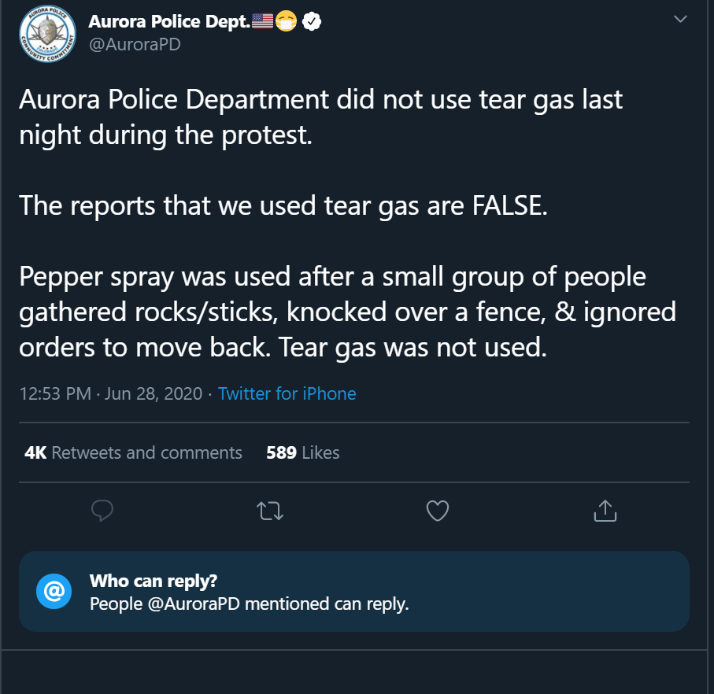
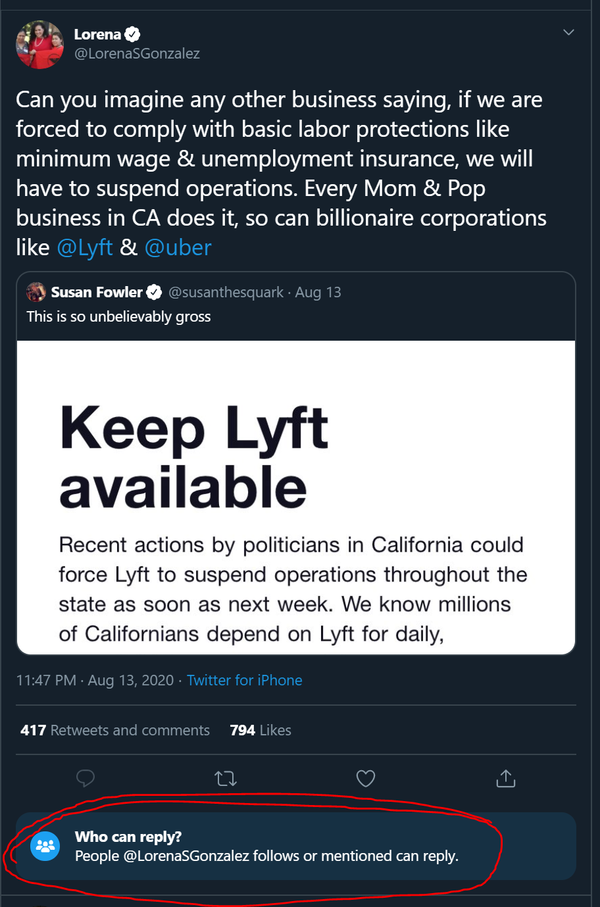

Twitter has recently allowed any account to disable replies, or enable them only for their mutuals. I think this short-sighted and it will result in a couple problems, one is already showing itself.

For most of history one talked to more people, sometimes in a day, than one would ever read in a lifetime. Today we read, watch, & listen to more recordings of people than we will ever have conversations with. The world moved from Knowledge-and-News through dialogue to one through broadcast media.

The internet has started to reverse a trend that began with the printing press. After four hundred years of declining public spheres, Twitter (among others) brought us a new Agora. I think the value of this change is hard to comprehend, because what was once so common before the printing press has been gone for so long.

The intellectuals of Twitter are not the celebrities, scientists, journalists, comedian-podcasters, academics, etc. They are the mass of anons and little accounts, everyone willing to think out loud, doubt publicly, and use the gifts of anonymity or sincerity to speak true sentiments. By mixing these people, Twitter becomes a check, however small, on ideological thinking. Twitter also offers you the chance to befriend those who are doing and living in public, since it is an easy way to do what Andy Matuschak calls [working with the garage door up](https://notes.andymatuschak.org/z21cgR9K3UcQ5a7yPsj2RUim3oM2TzdBByZu). By these acts perhaps you may find your people, I personally find it to be a priceless place. It is easily the most valuable intellectual social network.

I once wrote that *"I don't think even @jack fully appreciates the nature of the thing he has built. He is still concerned with just who should be promoted, or who might best be an arbiter of truth or content, over other ways of organizing the platform. A careful lesson from before the age of print may give us a better answer, if we can find it."* (from [Are We Still Thinking?](https://medium.com/@simon.sarris/are-we-still-thinking-795bd9f4a658)) I still think that's true. And I worry that the curtailing of replies may destroy part of what makes Twitter different from the average broadcast machine.

I understand why some people welcome the feature. When it rolled out in May, plenty of people gave compelling reasons to want to reduce the public nuisance (and harassment) burden. But we are witnessing the very slow closing of a large door. I worry that this isn't the first new feature modulating replies and it won't be the last.

I hope Twitter carefully considers what they are doing, but I think it will be easy to pass over this quickly. Less nuisance, happy celebrities, maybe engagement even stays about the same. What we lose is more subtle.
How many Twitter mutuals do I follow because of some comment of theirs on a public voice? How many great people you follow have you found this way? Isn't it most of them?

How many brilliant people sit a while on the shore of nothingness, because they have no popular friends to retweet them, then decide Twitter isn't worth it? It sucks to be a person continuously dogged by crappy people on this site, I know it happens, but it also sucks to be a strange weirdo with no friends and no way to find your people. Twitter is a great platform but the discoverability is very, very low. Now its just a little lower.

One problem with ideologies and cults is that the people in them rarely see the outside. On (political) bad tweets its a nice feature that they come with an army of fact checking and doubting replies. It's a check on ideology and unhinged-but-popular people's sentiments, and it can let others know that doubt exists. I expected to see this feature used politically already, and it didn't take long: In June (about a month after the feature was announced), the Aurora police department made a tweet claiming no tear gas was used at a protest. If they were lying, people would easily be able to post photos or videos showing otherwise. Now they can't.

Today, a California public official commenting on policy used the feature to stave off any critical replies:

And so we begin to lose the public sphere that Jack created.

There is probably a compromise for a feature like this. I think it wiser to have an option that could auto-hide and auto-mute non-mutuals, where anyone could click to see those replies. This would combine, and be more useful than, the previous manually-hide-replies feature, and a little less crushing to the Agora in the process.