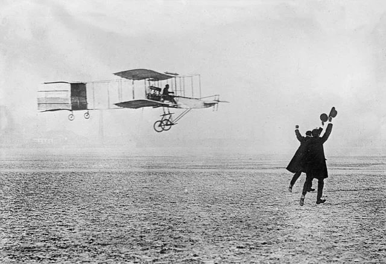

  Tyler Cowen's <a href="https://marginalrevolution.com/marginalrevolution/2019/12/work-on-these-things.html" target="_blank">
  Work on these things</a> post has great suggestions for what to work on in the future, though they mostly
  carve into the typical economist grooves. To extend his idea, here are some projects I think are important, that I'd
  like to see attempted or funded, or will attempt myself.

  <strong>Develop the aesthetics of progress.</strong>
  Humans have innate, Apollonian love of an ordered world and the mastery of immense forces,
  including mastery of nature, from beautiful gardens to spaceflight.
  These feelings speak to us, capturing them propels us. The beauty in these things matters.

  

    

      
    

  

  

    

      
    

  

Rationalistic worldviews have downplayed much of what motivates humans, which seems like a uniquely modern mistake.
This impacts every aspect of lives,
including scientific progress, architecture, even birth rates.
The future starts from belief, not rationalism, and belief is cultivated partly with aesthetics.
Progress will come from regaining a grasp on the aesthetics that move us.

  <strong>Develop the folk future.</strong> Consider the difference between these two images:

  

    

      
    

  

  

    

      
    

  

  How do they make you feel?

  Visions of the future need to allow people—not just the cleverest among us, but all people—to
  imagine accepting their place in a natural order.
  For any future place, there has to be a feeling that you could come of age there,
  not just explore it once you are already an adult.

  Many fairy tales and stories generally are about finding one's place.
  You start as a child, full of wonder, and you end with the mastery of the world.
  So it is with creating the future:
  If you want people to <em>believe</em> in progress,
  the fairy tale is what you must show them, not the cyber highway or the economic version of vital statistics.
  If the future is to be concieved, I hope it is one that is far happier, messier, and greener than
  futuristic cinema currently enjoys depicting.

  <strong>Make the world better for average people.</strong> The lowest hanging fruit in the progress
  of many endeavors is forgotten because the average person is often forgotten. It's worth starting
  to explore the area by simply asking ourselves, what products, apps, etc, have improved the lives of
  the average person (barely online, barely tech literate) the most in the past 10 years? How? How are they
  different from the ones that have improved our (presumably tech-literate) lives?

  For example, in many (semi-)rural communities near me, I think Square card readers have changed the game
  for viability of farmers markets, makers markets, and other pop-up businesses.
  I know they have for my low-tech friends. In this way Square perhaps has done more than the FANGs combined
  to change the livelihoods of semi-rural places in the last decade.
  <em>What other services are not-affluent-20-to-30-somethings missing?</em>
  What is still too hard for the average person to do? How can we improve it?

<strong>Recapture beauty.</strong>

  

    

      
    

  

  

    

      
    

  

How did this happen? Even rich people often live in terribly ugly homes.
With all the advantages of technology, we rarely build beautiful structures.
All the progress in mechanization and materials seems to be little match
for the colossal bad taste that permeates modern environments.
It is far easier to move the earth than it was 200 years ago,
yet the end result gives a feeling that nobody is really trying their best.

This extends beyond structures. The machine age has let us do so much, but it has also degraded work and craft
into a means, taking something away from us in the process.
What it has done to work it has done to art and leisure as well.
If we may have another renaissance, it will be a recapturing of beauty.

Where gods may exist in history, they walk in gardens, temples, groves.
I wonder every day: If we stop building beautiful places and magnificent things, why have we done so?
What forces have left the world? What work can we do towards recapturing these things?

